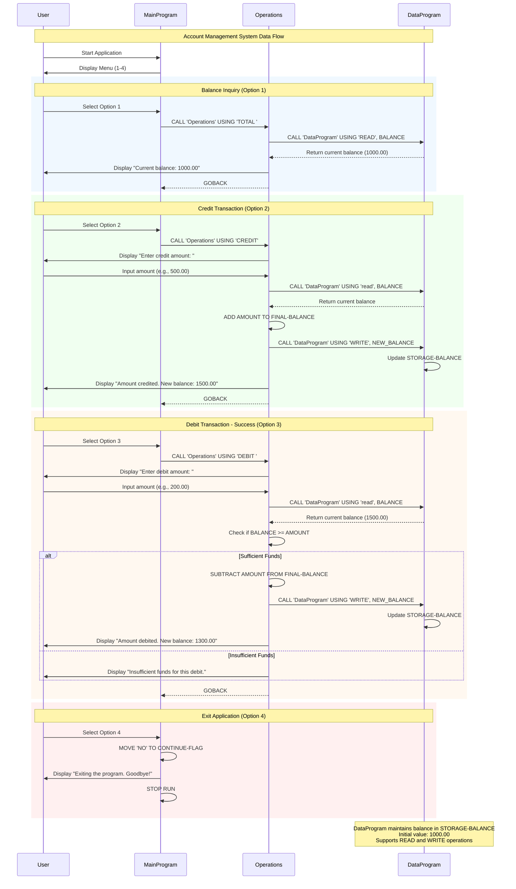

# COBOL Account Management System Documentation

## Overview

This COBOL-based Account Management System provides basic banking functionality for student accounts. The system consists of three main COBOL programs that work together to manage account operations, data persistence, and user interaction.

## System Architecture

The system follows a modular architecture with three core components:

1. **Main Program** (`main.cob`) - User interface and menu system
2. **Operations Program** (`operations.cob`) - Business logic for account operations
3. **Data Program** (`data.cob`) - Data storage and retrieval

## COBOL Files Documentation

### 1. main.cob - Main Program

**Purpose**: Entry point for the Account Management System that provides a user-friendly menu interface.

**Key Functions**:

- Displays the main menu with available options
- Accepts user input for menu selection
- Routes user choices to appropriate operations
- Manages the main program loop until user exits

**Business Rules**:

- Menu options are numbered 1-4 for easy user selection
- Invalid menu choices display error messages
- Program continues until user explicitly chooses to exit (option 4)
- All account operations are delegated to the Operations program

**Program Flow**:

1. Display Account Management System menu
2. Accept user choice (1-4)
3. Call appropriate operation based on selection:
   - Option 1: View Balance (`TOTAL`)
   - Option 2: Credit Account (`CREDIT`)
   - Option 3: Debit Account (`DEBIT`)
   - Option 4: Exit program
4. Repeat until user chooses to exit

### 2. operations.cob - Operations Program

**Purpose**: Handles all account transaction logic and business rules for student accounts.

**Key Functions**:

- **Balance Inquiry** (`TOTAL`): Retrieves and displays current account balance
- **Credit Operation** (`CREDIT`): Adds funds to the account
- **Debit Operation** (`DEBIT`): Withdraws funds from the account with validation

**Business Rules**:

- **Initial Balance**: All student accounts start with $1,000.00
- **Credit Transactions**:
  - Accepts any positive amount
  - Updates balance immediately
  - Displays confirmation with new balance
- **Debit Transactions**:
  - Validates sufficient funds before processing
  - Prevents overdrafts (balance must be >= debit amount)
  - Displays "Insufficient funds" message for invalid debits
  - Updates balance only for valid transactions

**Data Fields**:

- `OPERATION-TYPE`: 6-character operation identifier
- `AMOUNT`: Transaction amount (up to 999,999.99)
- `FINAL-BALANCE`: Current account balance

**Error Handling**:

- Insufficient funds protection for debit operations
- Input validation for transaction amounts

### 3. data.cob - Data Program

**Purpose**: Provides centralized data storage and retrieval services for account information.

**Key Functions**:

- **READ Operation**: Retrieves current balance from storage
- **WRITE Operation**: Updates stored balance with new value

**Business Rules**:

- **Data Persistence**: Maintains account balance in working storage
- **Default Balance**: Initializes with $1,000.00 for new accounts
- **Atomic Operations**: Each read/write operation is independent
- **Data Integrity**: Ensures balance consistency across operations

**Data Fields**:

- `STORAGE-BALANCE`: Primary balance storage (up to 999,999.99)
- `OPERATION-TYPE`: Operation identifier (`READ` or `WRITE`)

**Usage Pattern**:

```cobol
CALL 'DataProgram' USING 'READ', BALANCE-VARIABLE
CALL 'DataProgram' USING 'WRITE', BALANCE-VARIABLE
```

## Student Account Specific Rules

### Account Initialization

- All student accounts begin with a default balance of $1,000.00
- No minimum balance requirements for maintaining the account

### Transaction Limits

- **Maximum Balance**: $999,999.99 (system limitation)
- **Maximum Transaction**: $999,999.99 per operation
- **Minimum Transaction**: $0.01 (implied by 2 decimal places)

### Overdraft Protection

- **Strict Overdraft Prevention**: Debit transactions are rejected if they would cause a negative balance
- **Real-time Validation**: Balance is checked before each debit operation
- **User Notification**: Clear error messages for insufficient funds

### Data Integrity

- **Consistent State**: Balance is always read before modification
- **Immediate Updates**: All successful transactions update the stored balance immediately
- **Transaction Atomicity**: Each operation completes fully or not at all

## System Limitations

1. **Single Account**: System manages only one account at a time
2. **No Persistence**: Data is lost when the program terminates
3. **No Transaction History**: No record of past transactions
4. **No User Authentication**: No security measures implemented
5. **Simple Data Types**: Limited to basic numeric and character data

## Future Enhancements

- File-based persistence for data retention
- Multiple account support
- Transaction history logging
- User authentication and authorization
- Enhanced error handling and validation
- Integration with external banking systems

## Usage Instructions

1. Compile all three COBOL programs
2. Run the `MainProgram` executable
3. Follow the on-screen menu prompts
4. Select operations by entering numbers 1-4
5. Follow prompts for credit/debit amounts
6. Choose option 4 to exit the system

## Technical Requirements

- COBOL compiler (GnuCOBOL or similar)
- Terminal/console environment for user interaction
- Sufficient memory for program execution

## System Data Flow Diagram

The following sequence diagram illustrates the data flow and interactions between the three COBOL programs for different operations:



### Diagram Legend

- **Blue sections**: Read-only operations (Balance inquiry)
- **Green sections**: Credit operations (Adding funds)
- **Orange sections**: Debit operations (Withdrawing funds)
- **Red sections**: System termination
- **Solid arrows**: Direct program calls and user interactions
- **Dashed arrows**: Return values and responses

### Key Data Flow Points

1. **User Input**: All user interactions go through the MainProgram's menu system
2. **Operation Routing**: MainProgram delegates all business logic to Operations program
3. **Data Persistence**: Operations program calls DataProgram for all balance read/write operations
4. **Validation**: Business rules (like overdraft protection) are enforced in Operations program
5. **User Feedback**: All transaction results are displayed directly from Operations program

---

*This documentation covers the COBOL Account Management System designed for student account operations. For technical support or modifications, refer to the source code in the `/src/cobol/` directory.*
